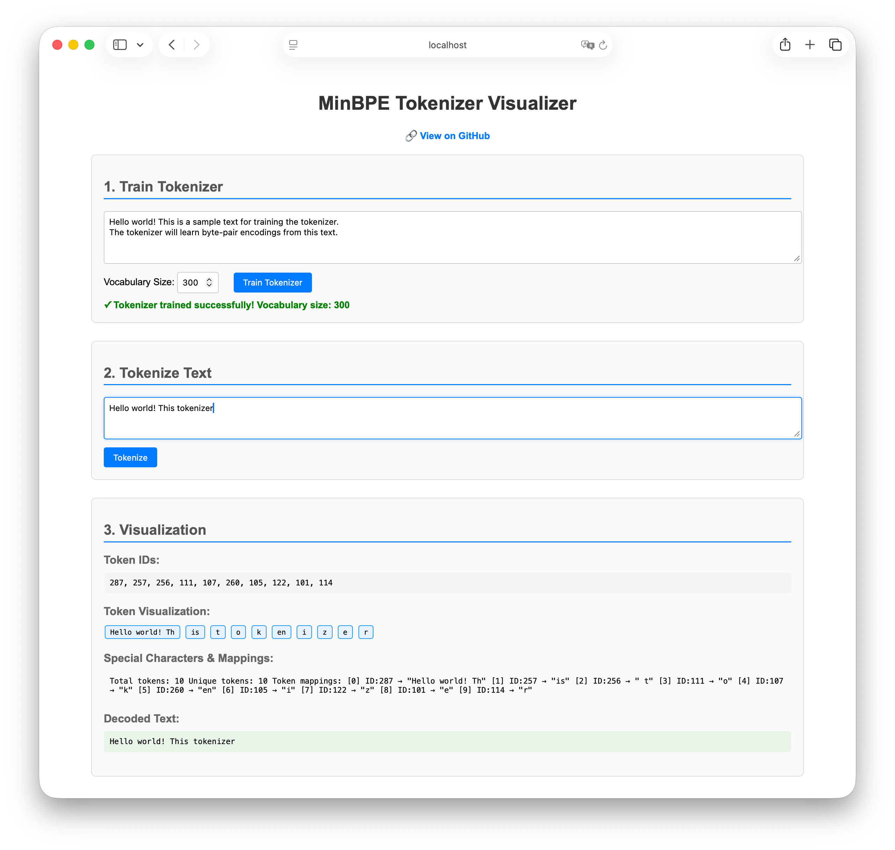

# minbpe



**Fork Notice**: This is a fork of the original [minbpe](https://github.com/karpathy/minbpe) by Andrej Karpathy, enhanced with a **Kotlin Multiplatform (KMP) port** and an interactive **web UI visualizer** that demonstrates the power of Kotlin Multiplatform by running the same tokenizer code across JVM, Android, iOS, macOS, Linux, JavaScript, and WebAssembly platforms.

## 🚀 New Features in this Fork

- **Kotlin Multiplatform Library**: Full BPE implementation in Kotlin that runs on all major platforms
- **Interactive Web UI**: Browser-based tokenizer visualizer built with Kotlin/JS
- **Cross-Platform Consistency**: Identical tokenization results across all supported platforms
- **Live Tokenization**: Real-time visualization of BPE token splitting and merging

## 🌐 Try the Web UI

Experience the tokenizer in action: [**Live Demo**](https://michalharakal.github.io/minbpe/) (or build locally with `./gradlew :ui-sample:jsBrowserDistribution`)

---

Minimal, clean code for the (byte-level) Byte Pair Encoding (BPE) algorithm commonly used in LLM tokenization. The BPE algorithm is "byte-level" because it runs on UTF-8 encoded strings.

This algorithm was popularized for LLMs by the [GPT-2 paper](https://d4mucfpksywv.cloudfront.net/better-language-models/language_models_are_unsupervised_multitask_learners.pdf) and the associated GPT-2 [code release](https://github.com/openai/gpt-2) from OpenAI. [Sennrich et al. 2015](https://arxiv.org/abs/1508.07909) is cited as the original reference for the use of BPE in NLP applications. Today, all modern LLMs (e.g. GPT, Llama, Mistral) use this algorithm to train their tokenizers.

There are two Tokenizers in this repository, both of which can perform the 3 primary functions of a Tokenizer: 1) train the tokenizer vocabulary and merges on a given text, 2) encode from text to tokens, 3) decode from tokens to text. 

## 📁 Repository Structure

### Original Python Implementation
The files of the original Python repo are as follows:

1. [minbpe/base.py](minbpe/base.py): Implements the `Tokenizer` class, which is the base class. It contains the `train`, `encode`, and `decode` stubs, save/load functionality, and there are also a few common utility functions. This class is not meant to be used directly, but rather to be inherited from.
2. [minbpe/basic.py](minbpe/basic.py): Implements the `BasicTokenizer`, the simplest implementation of the BPE algorithm that runs directly on text.
3. [minbpe/regex.py](minbpe/regex.py): Implements the `RegexTokenizer` that further splits the input text by a regex pattern, which is a preprocessing stage that splits up the input text by categories (think: letters, numbers, punctuation) before tokenization. This ensures that no merges will happen across category boundaries. This was introduced in the GPT-2 paper and continues to be in use as of GPT-4. This class also handles special tokens, if any.
4. [minbpe/gpt4.py](minbpe/gpt4.py): Implements the `GPT4Tokenizer`. This class is a light wrapper around the `RegexTokenizer` (2, above) that exactly reproduces the tokenization of GPT-4 in the [tiktoken](https://github.com/openai/tiktoken) library. The wrapping handles some details around recovering the exact merges in the tokenizer, and the handling of some unfortunate (and likely historical?) 1-byte token permutations.

### Kotlin Multiplatform Implementation
- **[minbpe-kmp/](minbpe-kmp/)**: Complete Kotlin Multiplatform port of the tokenizer
  - **[library/](minbpe-kmp/library/)**: Core KMP library supporting JVM, Android, iOS, macOS, Linux, JS, and WASM
  - **[ui-sample/](minbpe-kmp/ui-sample/)**: Interactive web UI built with Kotlin/JS demonstrating real-time tokenization

### Additional Tools
- **[tokenizer-comparison-tool/](tokenizer-comparison-tool/)**: Cross-platform validation tool ensuring consistency between Python and Kotlin implementations
  - 📋 **[Architecture Documentation](TOKENIZER_COMPARISON_ARCHITECTURE.md)**: Comprehensive system design, data flow, and component architecture

Finally, the script [train.py](train.py) trains the two major tokenizers on the input text [tests/taylorswift.txt](tests/taylorswift.txt) (this is the Wikipedia entry for her kek) and saves the vocab to disk for visualization. This script runs in about 25 seconds on my (M1) MacBook.

All of the files above are very short and thoroughly commented, and also contain a usage example on the bottom of the file.

## quick start

### Python (Original)

As the simplest example, we can reproduce the [Wikipedia article on BPE](https://en.wikipedia.org/wiki/Byte_pair_encoding) as follows:

```python
from minbpe import BasicTokenizer
tokenizer = BasicTokenizer()
text = "aaabdaaabac"
tokenizer.train(text, 256 + 3) # 256 are the byte tokens, then do 3 merges
print(tokenizer.encode(text))
# [258, 100, 258, 97, 99]
print(tokenizer.decode([258, 100, 258, 97, 99]))
# aaabdaaabac
tokenizer.save("toy")
# writes two files: toy.model (for loading) and toy.vocab (for viewing)
```

### Kotlin Multiplatform (New)

The same functionality is available in Kotlin across all platforms:

```kotlin
import sk.ainet.nlp.tools.tokenizer.BasicTokenizer

val tokenizer = BasicTokenizer()
val text = "aaabdaaabac"
tokenizer.train(text, 256 + 3) // 256 byte tokens + 3 merges
println(tokenizer.encode(text))
// [258, 100, 258, 97, 99]
println(tokenizer.decode(listOf(258, 100, 258, 97, 99)))
// aaabdaaabac
```

### Web UI (Interactive)

Try the tokenizer directly in your browser:

1. **Build the web app**: `cd minbpe-kmp && ./gradlew :ui-sample:jsBrowserDistribution`
2. **Open**: `minbpe-kmp/ui-sample/build/dist/js/productionExecutable/index.html`
3. **Experience**: Real-time tokenization with visual token breakdown

According to Wikipedia, running bpe on the input string: "aaabdaaabac" for 3 merges results in the string: "XdXac" where  X=ZY, Y=ab, and Z=aa. The tricky thing to note is that minbpe always allocates the 256 individual bytes as tokens, and then merges bytes as needed from there. So for us a=97, b=98, c=99, d=100 (their [ASCII](https://www.asciitable.com) values). Then when (a,a) is merged to Z, Z will become 256. Likewise Y will become 257 and X 258. So we start with the 256 bytes, and do 3 merges to get to the result above, with the expected output of [258, 100, 258, 97, 99].

## inference: GPT-4 comparison

We can verify that the `RegexTokenizer` has feature parity with the GPT-4 tokenizer from [tiktoken](https://github.com/openai/tiktoken) as follows:

```python
text = "hello123!!!? (안녕하세요!) 😉"

# tiktoken
import tiktoken
enc = tiktoken.get_encoding("cl100k_base")
print(enc.encode(text))
# [15339, 4513, 12340, 30, 320, 31495, 230, 75265, 243, 92245, 16715, 57037]

# ours
from minbpe import GPT4Tokenizer
tokenizer = GPT4Tokenizer()
print(tokenizer.encode(text))
# [15339, 4513, 12340, 30, 320, 31495, 230, 75265, 243, 92245, 16715, 57037]
```

(you'll have to `pip install tiktoken` to run). Under the hood, the `GPT4Tokenizer` is just a light wrapper around `RegexTokenizer`, passing in the merges and the special tokens of GPT-4. We can also ensure the special tokens are handled correctly:

```python
text = "<|endoftext|>hello world"

# tiktoken
import tiktoken
enc = tiktoken.get_encoding("cl100k_base")
print(enc.encode(text, allowed_special="all"))
# [100257, 15339, 1917]

# ours
from minbpe import GPT4Tokenizer
tokenizer = GPT4Tokenizer()
print(tokenizer.encode(text, allowed_special="all"))
# [100257, 15339, 1917]
```

Note that just like tiktoken, we have to explicitly declare our intent to use and parse special tokens in the call to encode. Otherwise this can become a major footgun, unintentionally tokenizing attacker-controlled data (e.g. user prompts) with special tokens. The `allowed_special` parameter can be set to "all", "none", or a list of special tokens to allow.

## training

Unlike tiktoken, this code allows you to train your own tokenizer. In principle and to my knowledge, if you train the `RegexTokenizer` on a large dataset with a vocabulary size of 100K, you would reproduce the GPT-4 tokenizer.

There are two paths you can follow. First, you can decide that you don't want the complexity of splitting and preprocessing text with regex patterns, and you also don't care for special tokens. In that case, reach for the `BasicTokenizer`. You can train it, and then encode and decode for example as follows:

```python
from minbpe import BasicTokenizer
tokenizer = BasicTokenizer()
tokenizer.train(very_long_training_string, vocab_size=4096)
tokenizer.encode("hello world") # string -> tokens
tokenizer.decode([1000, 2000, 3000]) # tokens -> string
tokenizer.save("mymodel") # writes mymodel.model and mymodel.vocab
tokenizer.load("mymodel.model") # loads the model back, the vocab is just for vis
```

If you instead want to follow along with OpenAI did for their text tokenizer, it's a good idea to adopt their approach of using regex pattern to split the text by categories. The GPT-4 pattern is a default with the `RegexTokenizer`, so you'd simple do something like:

```python
from minbpe import RegexTokenizer
tokenizer = RegexTokenizer()
tokenizer.train(very_long_training_string, vocab_size=32768)
tokenizer.encode("hello world") # string -> tokens
tokenizer.decode([1000, 2000, 3000]) # tokens -> string
tokenizer.save("tok32k") # writes tok32k.model and tok32k.vocab
tokenizer.load("tok32k.model") # loads the model back from disk
```

Where, of course, you'd want to change around the vocabulary size depending on the size of your dataset.

**Special tokens**. Finally, you might wish to add special tokens to your tokenizer. Register these using the `register_special_tokens` function. For example if you train with vocab_size of 32768, then the first 256 tokens are raw byte tokens, the next 32768-256 are merge tokens, and after those you can add the special tokens. The last "real" merge token will have id of 32767 (vocab_size - 1), so your first special token should come right after that, with an id of exactly 32768. So:

```python
from minbpe import RegexTokenizer
tokenizer = RegexTokenizer()
tokenizer.train(very_long_training_string, vocab_size=32768)
tokenizer.register_special_tokens({"<|endoftext|>": 32768})
tokenizer.encode("<|endoftext|>hello world", allowed_special="all")
```

You can of course add more tokens after that as well, as you like. Finally, I'd like to stress that I tried hard to keep the code itself clean, readable and hackable. You should not have feel scared to read the code and understand how it works. The tests are also a nice place to look for more usage examples. That reminds me:

## tests

We use the pytest library for tests. All of them are located in the `tests/` directory. First `pip install pytest` if you haven't already, then:

```bash
$ pytest -v .
```

to run the tests. (-v is verbose, slightly prettier).

## community extensions

* [gnp/minbpe-rs](https://github.com/gnp/minbpe-rs): A Rust implementation of `minbpe` providing (near) one-to-one correspondence with the Python version
* **This fork**: Kotlin Multiplatform implementation with interactive web UI demonstrating cross-platform tokenization

## 🛠️ Building the Kotlin Multiplatform Version

### Prerequisites
- Java 21+ (enforced across all modules)
- Gradle 8.x (included via wrapper)

### Build Commands
```bash
# Build all platforms
cd minbpe-kmp
./gradlew clean assemble allTests

# Build web UI only
./gradlew :ui-sample:jsBrowserDistribution

# Run platform-specific tests
./gradlew :library:jvmTest
./gradlew :library:jsTest
./gradlew :library:wasmJsTest
```

### Supported Platforms
- **JVM** (Java 21+)
- **Android** (minSdk 24, compileSdk 36)
- **iOS** (Arm64/Simulator)
- **macOS** (Arm64)
- **Linux** (x64/Arm64)
- **JavaScript** (Browser/Node.js)
- **WebAssembly** (WASM)

## exercise

For those trying to study BPE, here is the advised progression exercise for how you can build your own minbpe step by step. See [exercise.md](exercise.md).

## lecture

I built the code in this repository in this [YouTube video](https://www.youtube.com/watch?v=zduSFxRajkE). You can also find this lecture in text form in [lecture.md](lecture.md).

## todos

- write a more optimized Python version that could run over large files and big vocabs
- write an even more optimized C or Rust version (think through)
- rename GPT4Tokenizer to GPTTokenizer and support GPT-2/GPT-3/GPT-3.5 as well?
- write a LlamaTokenizer similar to GPT4Tokenizer (i.e. attempt sentencepiece equivalent)

## License

MIT
