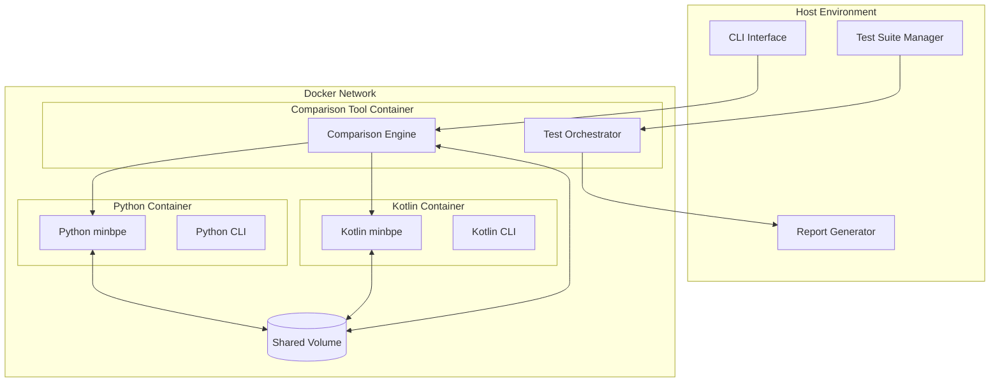
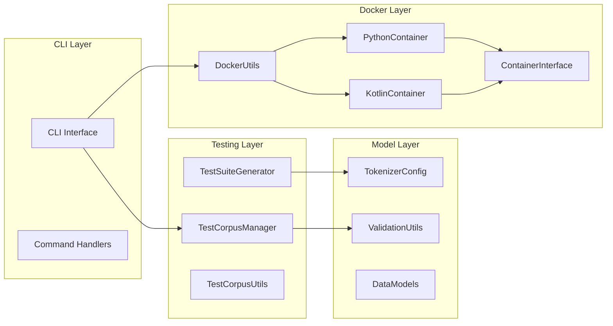
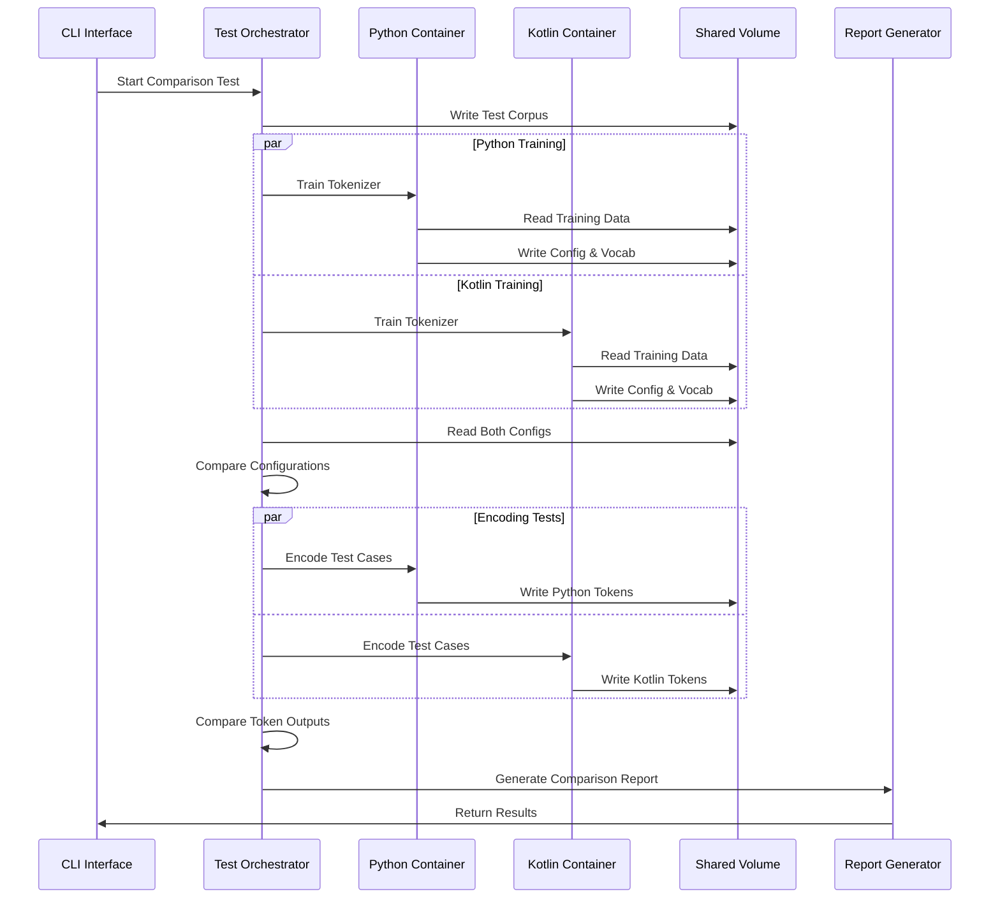
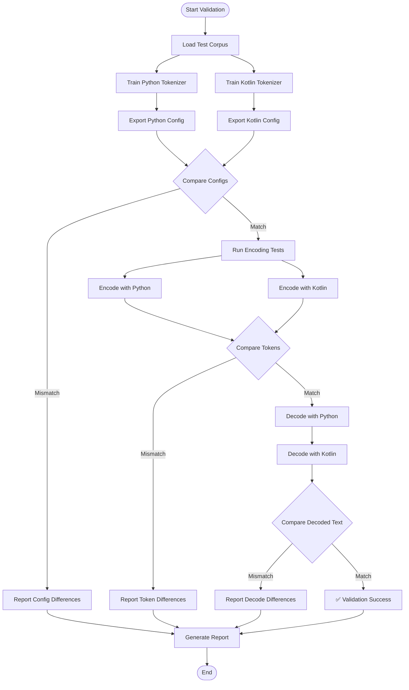
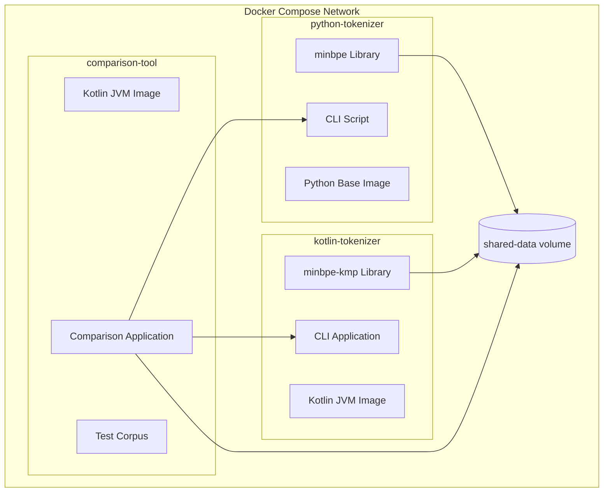
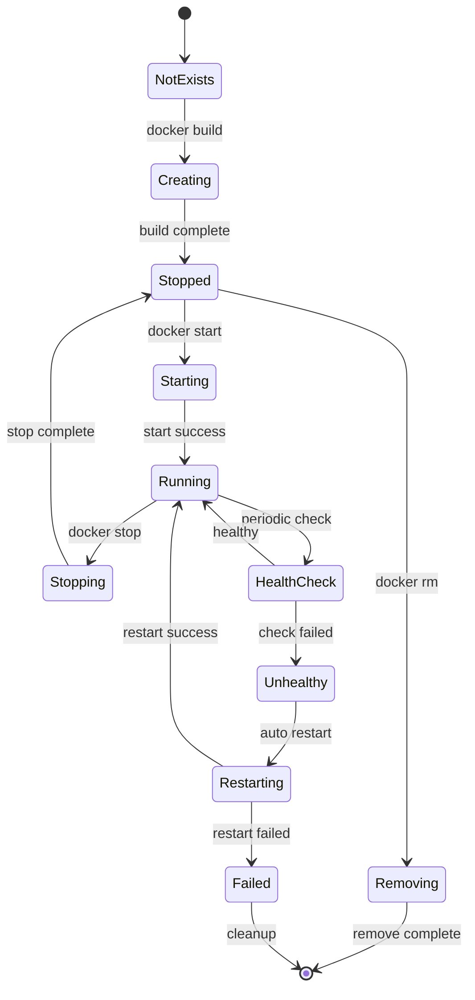
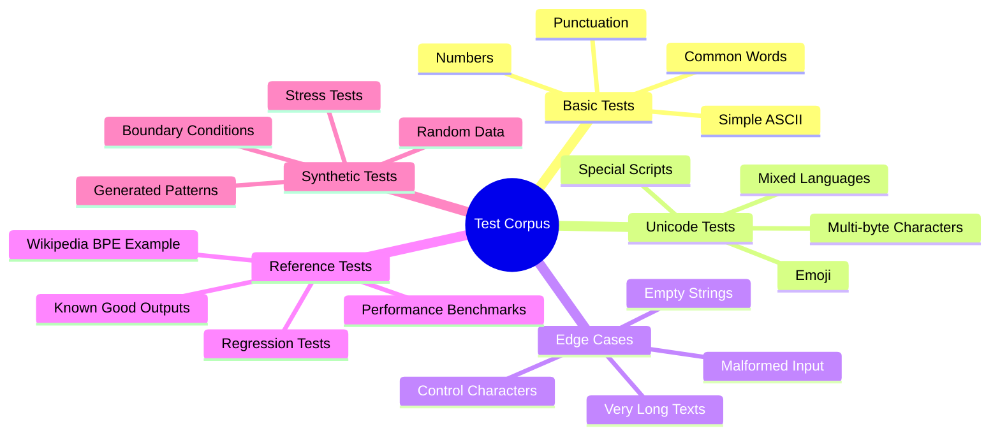
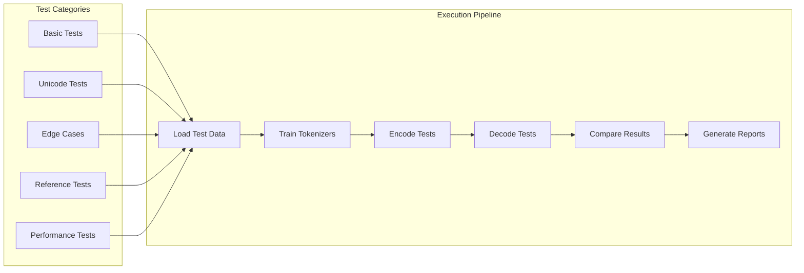

# Tokenizer Comparison Tool Architecture

## Overview

The Tokenizer Comparison Tool is a comprehensive validation and testing framework designed to ensure compatibility between the original Python minbpe implementation and the new Kotlin Multiplatform port. It provides Docker containerization, automated testing, performance benchmarking, and detailed reporting capabilities.

## 🏗️ System Architecture



## 🔧 Component Architecture

### Core Components



## 📊 Data Flow Architecture

### Training & Validation Flow



### Cross-Platform Validation Flow



## 🏛️ Module Structure

### Package Organization

```
sk.ainet.tokenizer.comparison/
├── cli/                    # Command-line interface
│   ├── ComparisonCLI.kt   # Main CLI entry point
│   └── CommandHandlers.kt  # Command implementations
├── docker/                 # Docker container management
│   ├── DockerUtils.kt     # Docker command utilities
│   ├── ContainerInterface.kt # Container abstraction
│   ├── PythonContainer.kt # Python implementation wrapper
│   └── KotlinContainer.kt # Kotlin implementation wrapper
├── model/                  # Data models and validation
│   ├── TokenizerConfig.kt # Configuration data model
│   ├── ValidationUtils.kt # Validation utilities
│   └── DataModels.kt      # Additional data structures
├── testing/               # Test management and execution
│   ├── TestCorpusManager.kt # Test data management
│   ├── TestSuiteGenerator.kt # Test case generation
│   └── TestCorpusUtils.kt # Corpus utilities
└── reporting/             # Report generation (planned)
    ├── ReportGenerator.kt # Report creation
    └── OutputFormats.kt   # Various output formats
```

### Docker Container Structure



## 🔄 Container Lifecycle Management

### Container States and Transitions



## 📋 Test Categories and Corpus Management

### Test Corpus Organization



### Test Execution Pipeline



## 🛠️ Technology Stack

### Core Technologies
- **Language**: Kotlin (JVM target)
- **Build System**: Gradle with Kotlin DSL
- **Containerization**: Docker & Docker Compose
- **Serialization**: kotlinx-serialization-json
- **Coroutines**: kotlinx-coroutines for async operations
- **Testing**: kotlin-test framework

### Container Technologies
- **Python Container**: Python 3.11 + minbpe
- **Kotlin Container**: OpenJDK 21 + minbpe-kmp
- **Shared Storage**: Docker volumes for data exchange
- **Networking**: Docker bridge network

### Development Tools
- **CLI Framework**: Custom command-line interface
- **Validation**: JSON schema validation
- **Reporting**: HTML, JSON, CSV output formats
- **Logging**: Structured logging with correlation IDs

## 📊 Current Implementation Status

### ✅ Completed Components
- **Docker Infrastructure**: Container setup and orchestration
- **Core Models**: Data structures and validation
- **Docker Utils**: Container management utilities
- **Test Corpus Manager**: Test data organization
- **Python Container Interface**: Python tokenizer wrapper
- **Basic CLI Structure**: Command framework

### 🚧 In Progress
- **Kotlin Container Interface**: Kotlin tokenizer wrapper
- **Test Suite Generator**: Automated test case creation
- **Comparison Engine**: Result validation logic
- **Report Generator**: Output formatting

### 📋 Planned Features
- **Performance Benchmarking**: Statistical analysis
- **CI/CD Integration**: Automated testing pipeline
- **Web Dashboard**: Visual comparison interface
- **Export/Import**: Configuration portability
- **Regression Testing**: Automated validation

## 🔧 Configuration and Usage

### Docker Compose Profiles
```yaml
# Start all containers
docker-compose --profile comparison up -d

# Health checks
docker-compose run --rm python-tokenizer health
docker-compose run --rm kotlin-tokenizer health

# Run comparison
docker-compose run --rm comparison-tool compare --help
```

### CLI Commands (Planned)
```bash
# Basic comparison
./gradlew run --args="compare --corpus basic --output report.html"

# Performance benchmark
./gradlew run --args="benchmark --iterations 100 --output perf.json"

# Export configurations
./gradlew run --args="export --format json --output configs/"

# Validate cross-platform
./gradlew run --args="validate --strict --report validation.html"
```

## 🎯 Design Goals

### Primary Objectives
1. **Compatibility Assurance**: Ensure identical behavior between implementations
2. **Performance Validation**: Compare execution characteristics
3. **Regression Prevention**: Catch breaking changes early
4. **Documentation**: Provide clear validation reports

### Quality Attributes
- **Reliability**: Consistent and reproducible results
- **Scalability**: Handle large test corpora efficiently
- **Maintainability**: Clean, modular architecture
- **Usability**: Simple CLI and clear reporting
- **Portability**: Cross-platform Docker deployment

## 🔮 Future Enhancements

### Planned Improvements
- **Real-time Monitoring**: Live comparison dashboard
- **Machine Learning**: Automated anomaly detection
- **Cloud Integration**: Distributed testing capabilities
- **API Interface**: REST API for external integration
- **Plugin System**: Extensible tokenizer support

This architecture provides a robust foundation for ensuring the quality and compatibility of the Kotlin Multiplatform minbpe implementation while maintaining clear separation of concerns and enabling future extensibility.